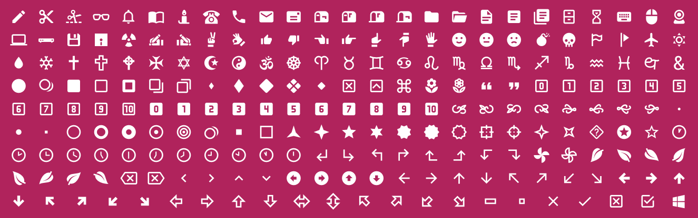

# MaterialDings

MaterialDings is a modernized replacement for the Wingdings font. Each glyph has been replaced with a simple, modern, and friendly icon in accordance with [Material Design guidelines](https://material.io/design/iconography/system-icons.html).

<p style='text-align:center'>
  
</p>

## Installing

Install MaterialDings with [npm](https://www.npmjs.com/) or [yarn](https://yarnpkg.com/):

``` bash
npm install -s materialdings
yarn add materialdings
```

## Usage

There are stylesheets available for CSS, SCSS, and LESS included in the package.

- `dist/MaterialDings.css`
- `dist/MaterialDings.scss`
- `dist/MaterialDings.less`

You may also directly import the fonts. The font is available in WOFF2, WOFF, TTF, and SVG formats.

- `dist/fonts/MaterialDings.woff2`
- `dist/fonts/MaterialDings.woff`
- `dist/fonts/MaterialDings.ttf`
- `dist/fonts/MaterialDings.svg`

---

## Building Your Own Variations

The entirety of this font is built off of SVG path data. Most of the icons come directly from the Material Design Icons library via `@mdi/js`. However, there are some icons that are not in that library yet or were not accepted into the library for various reasons. To handle these cases, there is a place where you can specify your own icon path data.

### Icon Definitions

- To use an icon from the MDI library, reference the icon in the `definition.json` file with the `mdi:` prefix and then use the name of the icon in pascal case. For example, if you wanted to use the `account-multiple-outline` icon, you would specify `mdi:AccountMultipleOutline` in the icon definition for the appropriate Unicode value.

- To use a custom icon, copy the path data to the `assets/icons.mjs` file with a unique variable name that begins with `svg`. Then reference that new icon in the `definitions.json` file with the `svg:` prefix. For example, if you named your new icon `svgMyNewAwesomeIcon`, you would specify `svg:MyNewAwesomeIcon` in the icon definition for the appropriate Unicode value.

Examples:

```json
  "\u0021": { "icon": "mdi:Pencil" },
  "\u0022": { "icon": "svg:MyCustomIcon" },
```

### Icon Transformations

You can also apply transformations to icons in the `definitions.json` file. To do this, add a `transform` array to the Unicode definition.

```json
  "\u00CD": {
    "icon": "mdi:Leaf",
    "transform": [
      { "type": "rotate", "value": 90 },
      { "type": "flip", "value": "horizontal" },
      { "type": "scale", "value": 0.5 }
    ]
  },
```

The available transformations include:

- **rotate** [Integer]: The angle to rotate the glyph
- **flip** [Enum: `horizontal`, `vertical`, `both`]: The direction to flip the glyph
- **scale** [Float]: The multiplier to scale the glyph

---

## Why did we create MaterialDings

As Accusoft began development on their newest offering, [PrizmDoc Editor](https://www.accusoft.com/products/prizmdoc-editor/overview/), which allows users to create and edit DOCX files directly in their browsers, it was quickly discovered that we could not assume font availability on client computers. Coupled with the complexities of licensing and delivering the original Wingdings font file, we decided to create an open font replacement for Wingdings, using the already great open-source font library, [Material Design Icons](https://materialdesignicons.com/).

A more in-depth look into the creation of MaterialDings will be coming soon on the [Accusoft Blog](https://www.accusoft.com/blog/).

---

## Special Thanks

A special thanks to the [Material Design Icons](https://materialdesignicons.com/) community for the awesome work they do on providing high-quality icons in the Material Design style.

---

## License

The font and glyphs are licensed under the [SIL Open Font License (OFL)](https://scripts.sil.org/Ofl).

This package is licensed under MIT.

Please see the LICENSE.md file for more detailed license information.
